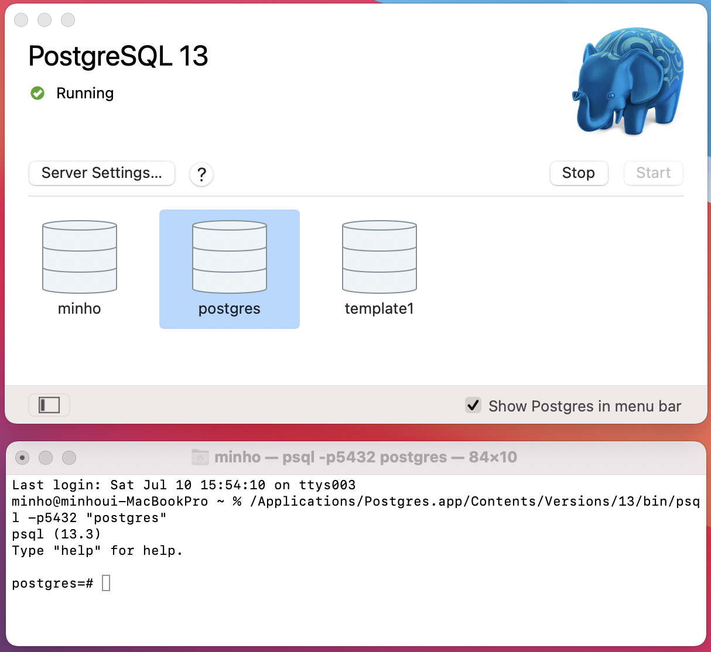

# PostgreSQL
PostgreSQL은 오픈소스 관계형 데이터베이스로 대용량 Transaction 처리, GIS에 유용한 특징을 가지고 있습니다.

## 환경설정
### • 설치하기
**PostgreSQL**  
[공식 홈페이지](https://postgresapp.com/)에서 PostgreSQL을 설치할 수 있습니다. 설치 후, 아래 명령어를 터미널에 입력하여 PostgreSQL CLI를 사용할 수 있도록 설정합니다.

```
sudo mkdir -p /etc/paths.d &&
echo /Applications/Postgres.app/Contents/Versions/latest/bin | sudo tee /etc/paths.d/postgresapp
```

**pgAdmin**  
PostgreSQL의 GUI 환경으로, [공식 홈페이지](https://www.pgadmin.org/download/)에서 pgAdmin을 설치할 수 있습니다.

<br>

## Terminal
터미널로 database를 다루기 위해서, postgreSQL cli인 psql이 먼저 설치되어 있어야합니다.

### • Database 만들기
psql 환경으로 들어간 후, `CREATE DATABASE [DB이름];`을 통해 database를 만들 수 있습니다.

### • Database 지우기
psql 환경으로 들어간 후, `DROP DATABASE [DB이름];`을 통해 database를 지울 수 있습니다.

### • Database 연결하기
`psql [Option]... [DBNAME [USERNAME]]`를 통해 database에 연결 할 수 있으며, 아래는 예시 입력입니다.  
`psql -h localhost -p 5432 -U minho [DB이름]`  
🔎 Option은 `psql --help`를 터미널에 입력하여 볼 수 있습니다.

### • Table 만들기
table은 아래와 같이 `CREATE TABLE [table 이름] ([column 이름] [Data Type])`으로 만들며, `\d`로 database에 있는 table들을 또는 `\d [table 이름]`으로 table의 column들을 볼 수 있습니다.
```
CREATE TABLE table_name (
  column_name datatype constraint
  ...
);
```

### • Table 지우기
`DROP TABLE [table 이름]`으로 table을 지울 수 있습니다.

### • Table에 Record(Row) 삽입하기
```
INSERT INTO table_name (column_name, ...])
VALUE (value, ...);
```
🔎 Option은 `/i`를 통해 sql파일로부터 record를 삽입할 수 있습니다.

\- Data Constraint
Data의 [Constraint](https://www.postgresql.org/docs/13/ddl.html)를 정의할 수 있습니다.

\- Data Constraint
[Data Type](https://www.postgresql.org/docs/13/datatype.html)을 정의할 수 있습니다.

### • Table 조회하기


### • Server 만들기

### • Server 연결하기
<!--  -->


## pgAdmin
### • Server 만들기


### • Google Cloud SQL
[Google Cloud SQL](https://cloud.google.com/sql)에서 SQL Database를 저장할 수 있습니다. 클라우드를 만드는 법은 [공식홈페이지](https://cloud.google.com/sql/docs/postgres/quickstart?hl=ko)에 기술되어 있습니다.
- PostgreSQL 인스턴스 만들기
- Cloud SQL 연결하기

## psql
psql은 postgres cli입니다.


## SQL
Structrued Query Language  
SQL은 관계형 데이터베이스에서 사용되는 언어
SELECT `row` from `table`

테이블은 row, column으로 구성되어 있음

## 참고 자료
[• 유튜브 강의](https://www.youtube.com/watch?v=qw--VYLpxG4)  
[• postgreSQL document](https://www.postgresql.org/docs/13/index.html)  
[• postgreSQL tutorial](https://www.postgresql.org/docs/online-resources/)