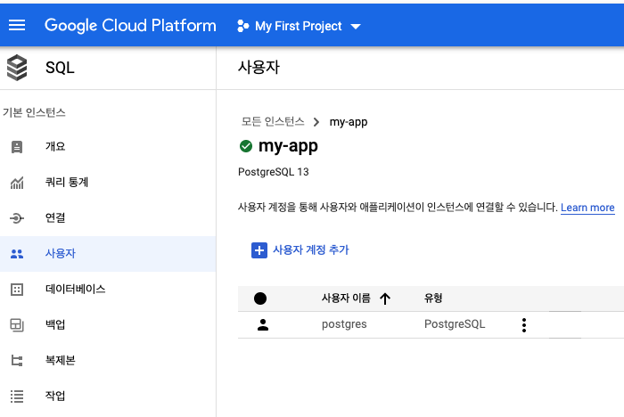

# Sequelize
[Sequelize](https://sequelize.org/master/manual/getting-started.html)는 관계형 데이터베이스를 위한 nodejs ORM입니다.

## 환경설정
### 설치하기
npm을 통해 sequelize와 해당 Database의 패키지를 설치합니다.
```
npm install --save sequelize
```
```
npm install --save pg pg-hstore # Postgres
npm install --save mysql2
npm install --save mariadb
npm install --save sqlite3
npm install --save tedious # Microsoft SQL Server
```
npm을 통해 sequelize-cli를 설치합니다. sequelize-cli는 터미널에서 sequelize 명령어를 입력하게 해주는 도구입니다.
```
npm install --save-dev sequelize-cli
```
## 설정하기
sequelize-cli로 애플리케이션 안에 Database의 빈프로젝트를 초기화 해줍니다. 빈프로젝트는 config, migrations, models, seeders 폴더 트리로 구성되어 있습니다.
```
npx sequelize-cli init
```

### database configuration
config.js에 sequelizer와 연동할 Database를 설정을 합ㄴ디ㅏ.
```
{
  "development": {
    "username": "db-username",
    "password": "db-password",
    "database": "db-name",
    "host": "dp-address",
    "dialect": "postgres"
  },
  "test": {
    "username": "db-username",
    "password": "db-password",
    "database": "db-name",
    "host": "dp-address",
    "dialect": "postgres"
  },
  "production": {
    "username": "db-username",
    "password": "db-password",
    "database": "db-name",
    "host": "dp-address",
    "dialect": "postgres"
  }
}
```

### sequelize configuration
[.sequelizerc](https://sequelize.org/master/manual/migrations.html#the--code--sequelizerc--code--file)는 sequelize-cli의 환경을 설정할 수 있는 파일입니다.
```
const path = require('path');

module.exports = {
  'config': path.resolve('config', 'database.json'),
  'models-path': path.resolve('db', 'models'),
  'seeders-path': path.resolve('db', 'seeders'),
  'migrations-path': path.resolve('db', 'migrations')
};
```

- Local Database  
터미널에 whoami를 입력하여 user name을 확인할 수 있습니다.
- Google Cloud SQL Database  


## sequelize cli
sequelize cli를 통해 Model, Migration, Seed 단계를 거쳐 Database를 만들 수 있습니다.  
[Migration](https://sequelize.org/master/manual/migrations.html)이란 Model Schema를 정의하고, 이를 테이블에 옮기는 것을 의미합니다.  

### Model 만들기
[Database Model](https://sequelize.org/master/manual/migrations.html#creating-the-first-model--and-migration-)을 만듭니다.

```
npx sequelize-cli model:generate --name User --attributes firstName:string,lastName:string,email:string
```
### Migration 실행하기
[Migration](https://sequelize.org/master/manual/migrations.html#running-migrations)을 Database에 옮깁니다.
```
npx sequelize-cli db:migrate
```
### Migration 취소하기
옮긴 [Migration](https://sequelize.org/master/manual/migrations.html#undoing-migrations)을 취소할 수 잇습니다.
```
npx sequelize-cli db:migrate:undo
```

### Seed
Seed는 테이블에 데이터를 삽입하는 것을 의미합니다.

**Seed 만들기**  
[Seed](https://sequelize.org/master/manual/migrations.html#creating-the-first-seed)를 만듭니다.
```
npx sequelize-cli seed:generate --name demo-user
```

**Seed Database에 넣기**
[Seed](https://sequelize.org/master/manual/migrations.html#running-seeds)를 Database에 넣어줍니다.
```
npx sequelize-cli db:seed:all
```

**Seed 취소하기**
```
npx sequelize-cli db:seed:undo
```

## API
### Model
[Model](https://sequelize.org/master/manual/model-basics.html)은 Database Table의 구조를 sequelize가 표현하는 것을 의미합니다.

**[Model 정의](https://sequelize.org/master/manual/model-basics.html#model-definition)**  
`sequelize.define`: 함수를 통해 모델을 정의할 수 있습니다.  
`extends model`: 상속을 통해 모델을 정의할 수 있습니다.

모델의 [스키마 데이터 타입](https://sequelize.org/master/manual/model-basics.html#data-types)은 다음과 같습니다.
- STRING
- TEXT
- BOOLEAN
- INT
- REAL
- DOUBLE
- DECIMAL
- ...

모델 [Validation](https://sequelize.org/master/manual/validations-and-constraints.html)

**[Model Sync](https://sequelize.org/master/manual/model-basics.html#model-synchronization)**  
`sequelize.sync`를 통해 Database와 Model을 동기화 합니다.

**[Time Stamp](https://sequelize.org/master/manual/model-basics.html#timestamps)**  
sequelize는 table을 만들때, 자동으로 createdAt, updatedAt을 column에 넣습니다. 이는 option으로 비활성화 할 수 있습니다.

**[Column Option](https://sequelize.org/master/manual/model-basics.html#column-options)**


**Model Define Example Code**
```
module.exports = (sequelize, DataTypes) => {
  const User = sequelize.define("User", {
    id: {
      allowNull: false,
      autoIncrement: true,
      primaryKey: true,
      type: DataTypes.INTEGER,
      defaultValue: new Date(),
    },
  }, {
    timestamps: false,
  });

  return User;
}
```

**Model-DB Connection Example Code**
```
const db = require("./database/models");
db.sequelize.sync().then((req) => console.log("model is synchronized with db"));
```

### Validation
https://sequelize.org/v5/manual/models-definition.html#validations


## Database 다루기
### Create

## Read
Database를 [조회](https://sequelize.org/master/manual/model-querying-finders.html)합니다.  
``findAll``: 전체 Database를 조회합니다.  
``findByPk``: Primary Key로 Database를 조회합니다.  
``findOne``: 조건에 맞는 Database 한개를 조회합니다.  
``findOrCreate``: 조건에 맞는 Database를 조회하고 없으면 Databae를 만듭니다.  
``findAndCountAll``: 전체 Database를 조회하고 갯수 반환합니다.  

### 탐색 Sequelize Query
[Model API](https://sequelize.org/v5/class/lib/model.js~Model.html)를 통해 다양한 조건으로 탐색할 수 있습니다.  
attribute를 통해 특정 coulumn만 가져올 수 있습니다.  
where을 통해 탐색 조건을 정의할 수 있습니다. (where은 기본적으로 and와 같습니다.)  
[op](https://sequelize.org/master/variable/index.html#static-variable-Op)를 통해 다양한 조건 연산을 할 수 있습니다.  
[order](https://sequelize.org/v5/manual/querying.html#ordering)를 통해 정렬된 Data를 받을 수 있습니다.
[limit](https://sequelize.org/master/manual/model-querying-basics.html#limits-and-pagination)를 통해 가져올 Data 개수를 정의할 수 있습니다.

```js
const { User } = require("./models");
const { Op } = require("sequelize");

User.findAll({
  attributes: ["name", "age"],
  where: {
    name: "minho"
    age: {
      [Op.gt]: 30
    },
    [Op.or]: [
      { location: "yong-in" },
      { occupation: "engineer" }
    ]
    order: [
      ["birth", "DESC"]
    ]
  }
})


```


[where](https://sequelize.org/v5/variable/index.html#static-variable-Op)

## 참조 자료
model 테이블 스키마 정의
migration 모델을 테이블에 옮기며, 모델 변화를 기억하고 잇음
seed 데이터베이스에 데이터 넣는과정

https://blog.devari.kr/2020/nodejs/nodejs-sequelize


[sequelize quick tutorial](https://www.youtube.com/watch?v=Eu-h3iUk45o)

(삭제할것)
https://baeharam.netlify.app/posts/Node.js/Node.js-Sequelize-%EB%8B%A4%EB%A3%A8%EA%B8%B0

검색
https://victorydntmd.tistory.com/92

좋은자료
https://velog.io/@cadenzah/sequelize-document-1

인덱스
https://mangkyu.tistory.com/96
https://velog.io/@gillog/SQL-Index%EC%9D%B8%EB%8D%B1%EC%8A%A4


crud 보기
https://www.youtube.com/watch?v=Crk_5Xy8GMA&t=4s

[index](https://velog.io/@gillog/SQL-Index%EC%9D%B8%EB%8D%B1%EC%8A%A4)  
[index](https://brunch.co.kr/@skeks463/25)  
[index](https://mangkyu.tistory.com/96)  
update / delete하면 기존거는 사용안하고, 새로운게 삽입되서 무거워짐...
[sql vs sequelide 문법 비교](https://spicycookie.me/Nodejs/sequelizecrud/)