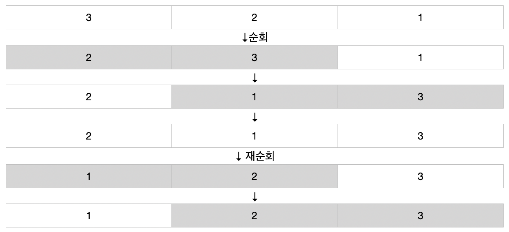

# 정렬
정리된 자료에서 값을 찾는것이, 정리되지 않은 자료에서 찾는것보다 효율적입니다. 이처럼 정렬이란 자료의 효율적인 관리를 위해, 자료를 어떤 기준에 따라 배치하는 것을 의미합니다. [시각화 된 자료](https://visualgo.net/bn/sorting?slide=1)를 통해 정렬에 대한 이해도를 높일 수 있습니다. 다음은 정렬(Sort)의 종류입니다.

- 버블 정렬
- 삽입 정렬
- 선택 정렬
- 빠른 정렬
- 병합 정렬
- 빠른 선택
- 계수 정렬

아래에서 각 정렬에 대해 자세히 살펴보겠습니다.

## 버블 정렬 (Bubble Sort)
버블 정렬은 제일 기본적인 정렬 알고리즘입니다. 전체 배열을 순회하며, 인접한 두 요소를 기준(오름차순/내림차순)에 따라 비교 및 교환하여 정렬합니다. 아래는 오름차순으로 정렬하는 버블 정렬의 도식도입니다. 도식도를 보면, 자료를 순회하며 오름차순으로 정렬되고 있습니다.



### 특성
**n개의 요소가 있을때, 자료를 순회하며 하나의 요소를 기준에 맞게 정렬시킵니다(맨 오른쪽에 제일 큰 요소를 위치시키며, 다음 순회에서는 맨 오른쪽의 왼쪽에 그 다음으로 큰 요소를 위치시킵니다., 즉 한번 순회에 남은 요소 중 제일 큰 요소를 올바른 위치에 정렬시킵니다.).** 이 과정을 n개의 요소에 대해 반복하므로 버블정렬의 시간복잡도 빅오는 O(n²)이 됩니다. 다만 정렬된 자료에 대해서는 한번만 순회하면 되기 때문에, 최적화된 버블 정렬 알고리즘을 사용한다면 빅오는 O(n)이 됩니다. 버블 정렬은 별도의 공간을 요구하지 않아 In Place이며, 공간복잡도 빅오는 O(1)입니다. 또한 정렬 후 중복된 값은 원래 자료와 순서가 동일하기 때문에 안정(Stable) 정렬입니다.

**버블 정렬 코드**
```js
// JavaScript
function bubbleSort(data) {
  for (let i = 0; i < data.length; i++) {
    for (let j = 0; j < data.length - i - 1; j++) {
      if (data[i] > data[i + 1]) {
        const temp = data[i];
        data[i] = data[i + 1];
        data[i + 1] = data[i];
      }
    }
  }
  return data;
}
```

<br>

## 삽입 정렬 (Insertion Sort)
삽입 정렬 또한 기본적인 정렬 알고리즘입니다. 정렬될 요소가 앞의 요소들과 기준(오름차순/내림차순)에 맞게 비교되어 알맞는 위치에 삽입되어 들어갑니다. 아래는 오름차순으로 정렬하는 삽입 정렬의 도식도입니다. 도식도를 보면, 자료를 순회하고 앞 요소들과 비교하여 요소를 위치에 맞게 삽입하고 있습니다.


### 특성
**n개의 요소가 있을때, 자료를 순회하며 하나의 요소를 기준에 맞게 삽입합니다. (해당 요소의 왼쪽을 탐색하며 삽입될 공간을 찾으며, 그 결과 왼쪽은 정렬된 상태이기에 원배열이 변경되어도 관계없습니다. 즉, 한번 순회에 왼쪽을 정렬시킵니다.)** 이 과정에서 요소 하나를 삽입하기 위해 앞부분을 순회 및 비교하므로 삽입정렬의 시간복잡도 빅오는 O(n²)이 됩니다. 다만 이미 정렬된 자료에 대해서는 시간복잡도 빅오는 O(1)입니다. 삽입 정렬은 별도의 공간을 요구하지 않아 제자리(In Place) 정렬이며, 공간복잡도 빅오는 O(1)입니다. 또한 정렬 후 중복된 값은 원래 자료와 순서가 동일하기 때문에 안정(Stable) 정렬입니다.

**삽입 정렬 코드**
```js
// JavaScript
function insertionSort (data) {
  for (let i = 0; i < data.length; i++) {
    let j = i;

    while (data[j] > data[j - 1] && j > 0) {
      const temp = data[j];
      data[j] = data[j - 1];
      data[j - 1] = temp;
      j--;
    }
  }

  return data;
}
```

<br>

## 선택 정렬 (Selection Sort)
선택 정렬은 기준(오름차순-최소값/내림차순-최대값)에 맞는 요소를 선택해 현재 위치에 놓음으로써, 배열을 정렬하는 알고리즘입니다. 아래는 오름차순으로 정렬하는 선택 정렬의 도식도입니다. 도식도를 보면 최소값이 현재 위치에 놓이게 함으로써, 오름차순으로 정렬되게 합니다.


### 특성
n개의 요소가 있을때, 현재 위치에 맞는 요소를 선택하기 위해 자료를 순회해야하며, 이를 n개의 위치에 반복해야하므로, 선택정렬의 시간복잡도 빅오는 O(n²)이 됩니다. (선택정렬은 순회 횟수가 고정되어 있어 평균, 최선, 최악의 경우에도 O(n²) 입니다.) 선택 정렬은 별도의 공간을 요구하지 않아 제자리(In Place)정렬이며, 공간복잡도 빅오는 O(1)입니다. 또한 정렬 후 중복된 값은 원래 자료와 순서가 동일하지 않기 때문에 불안정(Unstable)정렬입니다.

**선택 정렬 코드**
```js
//JavaScript
function selectionSort (data) {
  for (let i = 0; i < data.length - 1; i++) {
    let minIndex = i;

    for (let j = i + 1; j < data.length; j++) {
      if (data[j] < data[minIndex]) {
        minIndex = j;
      }
    }

    if (data[i] !== data[minIndex]) {
      const temp = data[i];
      data[i] = data[minIndex];
      data[minIndex] = temp;
    }
  }

  return data;
}
```

<br>

## 빠른 정렬 (Quick Sort)
빠른 정렬은 분할정복(Divide and Conquer) 정렬 알고리즘입니다. 기준점(Pivot)을 기준으로 왼쪽은 작은 요소들, 오른쪽은 큰 요소들로 자료를 정렬합니다. 정렬된 자료를 기준점으로 나누고 앞서 했던 과정을 요소가 하나 남을때까지 반복합니다. 이러한 재귀적 과정을 통해 자료를 정렬할 수 있습니다.

### 특성
빠른 정렬의 시간 복잡도는 O(nlog(n))입니다. 하지만 기준점을 잘 못 선정(기준점을 최대값이나 최소값으로 선정)할 경우 O(n²)이 됩니다. 빠른 정렬은 재귀함수의 콜스택을 위한 메모리 공간이 필요하므로 공간 복잡도는 O(nlog(n))입니다. 또한 정렬 후 중복된 값은 원래 자료와 순서가 동일하지 않기 때문에 불안정(Unstable) 정렬입니다.

**빠른 정렬 코드**
```js
//JavaScript
function quickSort (data, left, right) {
  const index = partition(data, left, right);

  if (index - 1 > left) {
    quickSort(data, left, index - 1);
  }

  if (index < right) {
    quickSort(data, index, right);
  }

  return data;
}

function partition (data, left, right) {
  let _left = left;
  let _right = right;
  const pivot = data[Math.floor((_left + _right) / 2)];

  while (_left <= _right) {
    let temp;

    if (_left + 1 >= _right) {
      _left = left;
      _right = right;
    }

    while (data[_left] < pivot) {
      _left++;
    }

    while (data[_right] > pivot) {
      _right--;
    }

    if (_left <= _right) {
      temp = data[_left];
      data[_left] = data[_right];
      data[_right] = temp;
      _left++;
      _right--;
    }
  }

  return _left;
}

quickSort([1, 5, 7, 2, 1, 8, 9], 0, [1, 5, 7, 2, 1, 8, 9].length - 1);
```

<br>

## 병합 정렬 (Merge Sort)
병합 정렬은 분할정복(Divide and Conquer) 정렬 알고리즘입니다. 자료를 요소가 하나가 될 때까지 분할한 후, 분할된 자료를 정렬하여 병합합니다. 이 과정을 원래 자료가 될 때까지 반복합니다. 이러한 재귀적 과정을 통해 자료를 정렬할 수 있습니다.

### 특성
병합 정렬의 시간 복잡도는 O(nlog(n))입니다. (병합정렬은 재귀 횟수가 고정되어 있어 평균, 최선, 최악의 경우에도 O(nlon(n)) 입니다.) 병합 정렬은 분할된 요소들을 저장할 공간이 필요하므로 공간 복잡도는 O(n)입니다. 또한 정렬 후 중복된 값은 원래 자료와 순서가 동일하기 때문에 안정(Stable) 정렬입니다.

**병합 정렬 코드**
```js
//JavaScript
function mergeSort (data) {
  if (data.length === 1) {
    return data;
  }

  const midpoint = Math.floor(data.length / 2);
  const leftData = data.slice(0, midpoint);
  const rightData = data.slice(midpoint);

  return merge(mergeSort(leftData), mergeSort(rightData));
}

function merge (leftData, rightData) {
  const mergedData = [];
  let leftDataIndex = 0;
  let rightDataIndex = 0;

  while (leftDataIndex < leftData.length && rightDataIndex < rightData.length) {
    if (leftData[leftDataIndex] > rightData[rightDataIndex]) {
      mergedData.push(rightData[rightDataIndex++]);
    } else {
      mergedData.push(leftData[leftDataIndex++]);
    }
  }

  const leftDataRemains = leftData.slice(leftDataIndex);
  const rightDataRemains = rightData.slice(rightDataIndex);

  return mergedData.concat(leftDataRemains).concat(rightDataRemains);
}

mergeSort([8, 5, 7, 4, 2]));
```
