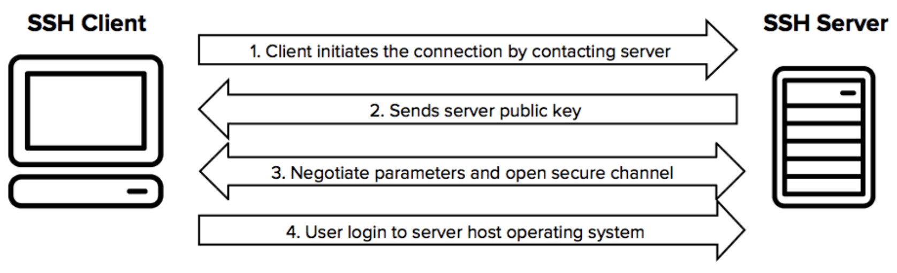

# SSH
SSH(Secure SHell)는 원격 컴퓨터에 접속하기 위한 프로토콜입니다. 기존 텔넷 방식은 보안에 약했기때문에, 1995년 암호화된 프로토콜인 SSH가 개발되었습니다.

## SSH 키
SSH는 서버에 접속하기 위해선, 비밀번호가 아닌 SSH키를 사용합니다. SSH키는 공개키/비공개키로 이루어져 있으며 이때 비공개키는 SSH Client에 공개키는 SSH Server에 위치합니다.
### 공개키 비공개키
공개키로 암호화하고, 비공개키로 복호화합니다.

[• SSH](https://www.ssh.com/academy/ssh/command)
