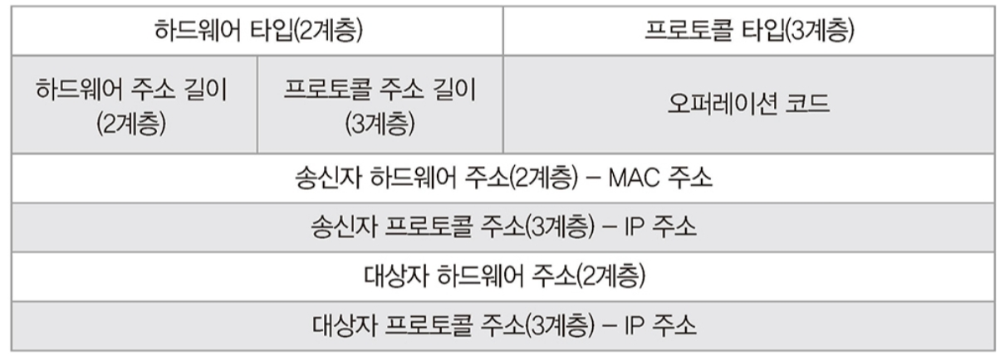

### Network

## OSI 7계층
OSI(Open System Interconnection) 7계층은 ISO에서 네트워크 시스템의 호환, 유지/보수를 위해 개발한 규격입니다.
  
일반적으로 통신을 위해 tcp/ip가 사용되므로, OSI 7계층을 tcp/ip 4계층으로 단순화하여 표현하기도 합니다.  
  
OSI 7계층은 계층별로 필요한 정보를 헤더에 담아 붙이고 떼며, 이를 인캡슐레이션(encapsulation), 디캡슐레이션(decapsulation)이라 합니다.  

### • 1계층 (물리 계층)
단말끼리 데이터를 전달할 수 있도록, 비트열 데이터를 전기신호로 변환하고 전송하는 계층입니다.
🔎 LAN 카드(Network Interface Controller)에서 전기신호로 변환합니다.  
**\- 장비**  
허브, 리피터, 케이블, 커넥터, 트랜시버, 탭  
🔎 전기신호 변환을 1계층에 둘지, 2계층에 둘지에 따라 LAN 카드의 계층을 정의할 수 있으며, 일반적으로 1계층에 두는 편입니다. 하지만 LAN 카드에서 MAC 주소가 할당되어 있으며 데이터의 MAC 주소를 검사하여 통과여부를 판단하므로 2계층 역할도 합니다. 따라서 LAN 카드는 1계층, 2계층에 중간에서 작동합니다.

### • 2계층 (데이터 링크 계층)
같은 네트워크에 있는 단말끼리 통신을 도와주는 계층입니다. 이때 일반적으로 이더넷 규칙을 기반으로 통신을 합니다. 허브 기반 통신에서 이더넷은 CSMA/CD(Carrier Sense Multiple Access with Collision Detection)를 통해 통신 충돌을 방지합니다. 2계층에서는 송신 단말 MAC 주소, 수신(목적) 단말 MAC 주소 헤더와 트레일러를 붙입니다.  
  
**\- 장비**  
스위치는 MAC 주소 테이블을 만들고, 이를 기반으로 2계층 Frame의 목적지(수신 단말) MAC 주소를 확인 후, 해당 MAC 주소에 데이터를 전송합니다.  
**\- ARP**  
ARP(Address Resolution Protocol)는 3계층 수신 단말의 IP 주소로부터 2계층 수신 단말의 MAC 주소를 알아내기 위한 프로토콜입니다.  
  
통신 단계에서 수신단말의 MAC 주소를 모르기 때문에 2계층 캡슐화를 할 수 없습니다. 따라서 네트워크 전체에 ARP 프로토콜을 브로드캐스트하고 해당 IP주소를 가진 단말의 MAC 주소를 유니캐스트로 받습니다. 이를 통해 2계층 캡슐화를 진행할 수 있습니다. ARP는 2계층 통신(로컬 네트워크)과 3계층 통신(원격지 네트워크)에 따라 작동 방식이 다릅니다. ARP의 브로드캐스트는 같은 네트워크일때 가능한 통신 방식입니다. 따라서 다른 네트워크와 통신할때는 3계층 장비에 ARP 요청을 보내 MAC 주소를 받을 수 있습니다.  
🔎 로컬 통신에서 패킷은 목적지 IP 주소와 MAC 주소가 수신 단말이지만, 원격 통신에서의 패킷은 목적지 IP 주소는 수신 단말이며 MAC 주소는 3계층 장비입니다.

### • 3계층 (네트워크 계층)
다른 네트워크에 있는 단말끼리 통신을 도와주는 계층입니다. 이때 IP를 기반으로 통신을 합니다. 3계층에서는 송신 단말 IP 주소, 수신(목적) 단말 IP 주소 헤더를 붙입니다.  
  
**\- 장비**  
라우터는 라우팅 테이블을 기반으로 라우팅(Routing)과 포워딩(Fowarding)하여, 다른 네트워크끼리 연결해주는 장비입니다. 라우터는 3계층 장비이기에 2, 3계층을 확인합니다. 이때 2계층의 도착지 MAC 주소와 해당 라우터 MAC 주소를 비교하여 동일하다면 3계층의 도착지 IP 주소를 라우팅 테이블에서 탐색하여 경로를 지정합니다. 만일 해당 IP가 없다면, 스위치와 달리 라우터는 통신 과부하 방지를 위해 브로드캐스트하지 않고 패킷을 버리며 이를 브로드캐스트 컨트롤이라 합니다.  
🔎 다른 네트워크와 통신하기 위해 라우터 IP가 필요하며, 이를 기본 게이트웨이라고 합니다.  
🔎 라우터가 3계층을 확인하기위해 2계층을 제거하였기에, 도착지 MAC 주소를 도착지 IP 주소에 맞게 다시 설정하고, LAN 프로토콜에서 WAN 프로토콜로 2계층을 다시 만듭니다.  
🔎 라우터 - 단말까지의 경로를 찾는것이 아닌, 라우터 - 라우터까지의 경로를 찾는 것을 홉-바이-홉(Hop-by-Hop) 라우팅이라 합니다. 이때 다음 라우터를 넥스트홉(Next Hop)이라 합니다.  

### • 4계층 (전송 계층)
데이터 전달(통신)의 신뢰성(분할, 조립)을 보장하고, 올바른 애플리케이션(포트)에 찾아가도록 하는 계층입니다.
이때 tcp/udp를 사용합니다.  
**\- 장비**  
로드 밸런서, 방화벽

### • 5계층 (세션 계층)
애플리케이션 연결이 안정적으로 유지되도록 관리합니다.

### • 6계층 (표현 계층)
애플리케이션 및 시스템의 통신을 위해, 형식을 변환하는 계층입니다. 인코딩, 압축 등을 수행합니다.

### • 7계층 (응용 계층)
애플리케이션(응용프로그램) 레벨에서 데이터 해석 및 통신을 하기 위한 프로토콜을 정의하는 계층입니다.  
\- web: http  
\- email: smtp  
\- file: ftp  
\- dns: dns

## IP
IP(Internet Protocol)어떤 네트워크의 어떤 컴퓨터를 가리키는 주소입니다.
IPv4: 32bit의 ip 주소입니다.
IPv6: 128bit의 ip 주소입니다.

IP(IPv4)는 32bit의 이진법이지만, 편하게 읽기 위해 8bit인 octect(옥텟)단위로 표현합니다. 아래 ip 주소를 변환하면 192.168.1.0과 같습니다.
11000000|10101000|00000001|00001010

### • ip class
ip주소는 네트워크id와 호스트id로 이루어져 있으며, 32 bit를 어떻게 네트워크, 호스트로 나누는지에 따라 클래스를 분류할 수 있습니다.  
**\- A 클래스**  
대규모 네트워크 ip 주소입니다.  
네트워크 id: 00000001 ~ 01111111 (1 ~ 127)
|네트워크 id 8bit||호스트 id 24bit|  
**\- B 클래스**  
중형 네트워크 ip 주소입니다.  
네트워크 id: 10000000 00000000 ~ 10111111 11111111 (128.0 ~ 191.255)
|네트워크 id 16bit||호스트 id 16bit|  
**\- C 클래스**  
소형 네트워크 ip 주소입니다.  
네트워크 id: 11000000 00000000 00000000 ~ 11011111 11111111 11111111 (192.0.0 ~ 223.255.255)  
|네트워크 id 24bit||호스트 id 8bit|  
**\- D 클래스**  
멀티캐스트 ip 주소입니다.  
**\- E 클래스**  
연구소 ip 주소입니다.  

### • 네트워크 주소 / 브로드캐스트 주소
**\- 네트워크 주소**  
네트워크 주소란 네트워크를 대표하는 주소로, 호스트 id가 이진법으로 00000000, 십진법으로 0인 ip주소입니다.  
**\- 브로드캐스트 주소**  
브로드캐스트 주소란 네트워크 전체를 나타내는 주소로, 호스트 id가 이진법으로 11111111, 십진법으로 255인 ip주소입니다.

### • 서브넷
네트워크를 분할하는 것을 서브넷이라 합니다. 기존 ip주소는 네트워크 id, 호스트 id로 이루어져 있으며 호스트 id를 서브넷 id와 호스트 id로 나누어 서브넷을 합니다. 아래는 A 클래스를 호스트 id에서 4bit를 빌려 서브넷팅한 것을 보여줍니다.  
00000001(네트워크 id)|00000000|0000000|00000000(호스트 id)  
00000001|0000(네트워크 id)|0000|0000000|00000000(호스트 id)  
**\- 서브넷 마스크**  
서브넷팅된 ip 주소의 네트워크 id와 호스트 id를 식별하기 위해, 서브넷 마스크를 사용합니다.  
00000001|0000(네트워크 id)|0000|0000000|00000000(호스트 id)의 서브넷 마스크는 255.240.0.0이며 prefix표기법으로는 /12입니다.

## tcp / ip
### •tcp
tcp(Transmission Control Protoclo)는 3 way handshaking과 데이터가 정상적으로 전달되었는지 확인함으로써, 데이터의 신뢰성을 보장하는 연결형 통신 프로토콜입니다. TCP 헤더에는 송신 단말 port, 수신 단말 Port, 플래그, 윈도우 크기 등이 담겨 있습니다.  
**\- 3 way handshaking**  
데이터를 전송하기 전에, 먼저 단말끼리 연결을 해야하며 3단계로 이루어집니다.  
1\. 송신단말에서 수신단말에 연결요청(SYN)을 보냅니다.  
2\. 수신단말은 연결응답(ACK)과 연결요청(SYN)을 보냅니다.  
3\. 송신단말은 연결응답(ACK)을 보내고 연결이 이루어집니다.  
연결을 종료할때도 3단계를 거칩니다.  
1\. 송신단말에서 수신단말에 연결종료요청(FIN)을 보냅니다.  
2\. 수신단말은 연결종료응답(ACK)과 연결종료요청(FIN)을 보냅니다.  
3\. 송신단말은 연결종료응답(ACK)을 보내고 연결이 종료됩니다.  

**\- 일련번호(sequence number)/응답번호(acknowledgement number)**  
TCP는 데이터를 분할하여 보냅니다. 따라서 분할된 데이터에 식별자를 붙이며 이를 일련번호라고 합니다. 송신단말에서 데이터를 정상적으로 받았는지 수신단말에 응답번호를 보냅니다. 만일 수신단말이 데이터를 비정상적으로 받았다면 재전송 요청을 보내게 됩니다.

### •udp
tcp(User Datagram Protoclo)는 데이터를 빠르게 전달하기 위한 비연결형 통신 프로토콜입니다. UDP 헤더에는 송신 단말 port, 수신 단말 Port 등이 담겨있습니다.

## DNS
DNS(Domain Name System)은 ip주소를 문자열의 도메인 주소로 변환하는 시스템입니다.
클라이언트(브라우저)에서 도메인 주소를 입력하면, DNS 서버에 쿼리를 보내고 해당 ip 주소를 받습니다. 이 ip 주소를 가지고 서버에 요청을 보낼 수 있습니다.
🔎 이떄 얻은 ip 주소를 캐시로 저장하여 다음 요청에서는 캐시에서 해당 ip주소를 찾습니다.
|third-level domain | second-level domain | top-level domain|
|-|-|-|
|www|google|com|

### • record
**\- a record**  
a record는 기본 record로 ipv4 주소와 맵핑됩니다.

**\- aaaa record**  
aaaa record는 ipv6 주소와 맵핑됩니다.

**\- cname record**  
cname record는 도메인 주소를 ip 주소가 아닌 또 다른 도메인 주소와 맵핑합니다. 이때 맵핑되는 도메인 주소는 ip 주소와 맵핑되어 있습니다.

## CDN
https://server-talk.tistory.com/52

캐싱...
https://cloud.google.com/cdn/?utm_source=google&utm_medium=cpc&utm_campaign=japac-KR-all-en-dr-bkws-all-all-trial-e-dr-1009882&utm_content=text-ad-none-none-DEV_c-CRE_286195723358-ADGP_Hybrid%20%7C%20BKWS%20-%20EXA%20%7C%20Txt%20~%20Networking%20~%20Cloud%20CDN_CDN-KWID_43700024981073026-kwd-332589974324&userloc_1009893-network_g&utm_term=KW_cloud%20cdn&gclid=CjwKCAjw7--KBhAMEiwAxfpkWB5IpAkFzHj4MIWiTX2PNkULNU8q0EP4uVOqpr-9OYPNbGxTW_8CaRoCgf0QAvD_BwE&gclsrc=aw.ds#section-6

### NAT/PAT

## http

http code
https://stackoverflow.com/questions/3297048/403-forbidden-vs-401-unauthorized-http-responses

# 네트워크 http로 옮기자.
웹소켓 nginx 프록싱 http://nginx.org/en/docs/http/websocket.html

https://www.zerocho.com/category/HTTP/post/5b3ba2d0b3dabd001b53b9db

## header
https://developer.mozilla.org/ko/docs/Web/HTTP/Headers

### 종단간 헤더 / 홉간 헤더

**\- x-forwarded-for**
http proxy나 loadbalancer를 통하기 전의 클라이언트의 원ip 주소입니다.
https://developer.mozilla.org/ko/docs/Web/HTTP/Headers/X-Forwarded-For

**\- host**
서버(요청받는)의 주소입니다.
https://developer.mozilla.org/ko/docs/Web/HTTP/Headers/Host

**\- upgrade**
http 1.1의 header로 변환할 프로토콜을 정의합니다. (http -> https, http -> websocket)
https://developer.mozilla.org/en-US/docs/Web/HTTP/Headers/Upgrade

**\- connection**
현재 전송이 완료된 후, 네트워크 접속을 유지할지를 제어합니다.
https://developer.mozilla.org/ko/docs/Web/HTTP/Headers/Connection

## 방화벽

## proxy

rest
https://sanghaklee.tistory.com/61